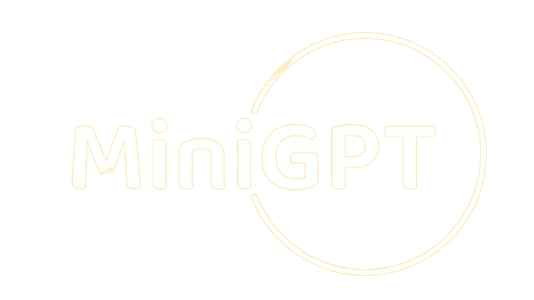
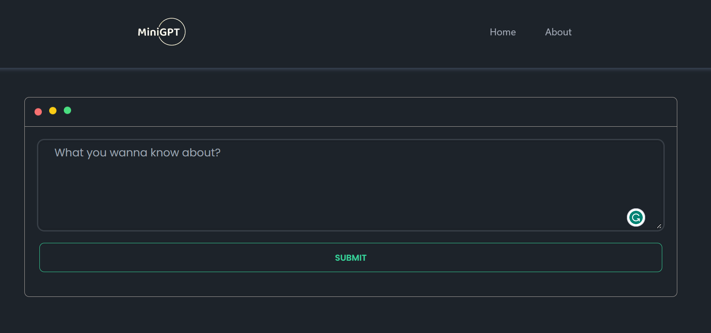
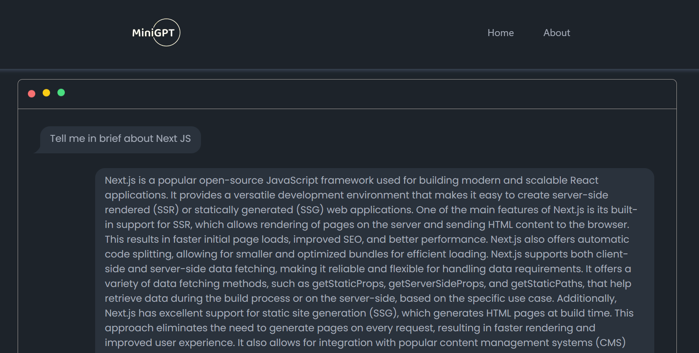

# Mini-GPT
---

## What is Mini-GPT?
Mini-GPT is a small chatbot that uses the GPT-3 API to generate responses to user input. It is a single input based interactive chatbot that uses the Davinci engine of the OpenAI API to answer questions on a mac like sleek minimal UI with animations.



### Tech Stack
 &nbsp;
 &nbsp;
 &nbsp;
 &nbsp;
 &nbsp;
 &nbsp;

### How it looks?

#### Home


#### Chat


### Installation and Usage
1. Clone the repository
```bash
git clone https://github.com/Lakshit-Chiranjiv/mini-gpt

cd mini-gpt
```

2. Install the dependencies
```bash
npm install
```

3. Create a .env file and add your OpenAI API key
```bash
touch .env.local
```
```env
OPEN_AI_API_KEY=YOUR_API_KEY
```

4. Run the application
```bash
npm start
```

### Contributing

Contributions and suggestions are welcome! Please fork the repository and create a pull request.

## Thank you for visiting! 😄🔥

Here's a tomato for you 🍅

